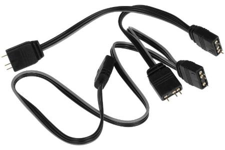
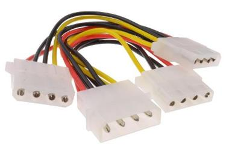
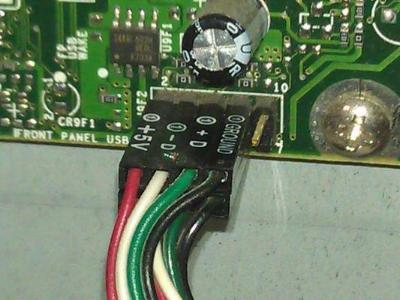

# ARGB4All

[ Документация на русском](README_RU.md)

There may be situations when you have a good enough motherboard on your PC,
but it cannot control the ARGB backlight. This project tries to solve this problem.

The project consists of two parts *FIRMWARE* and [GUI](https://github.com/lazenyuk-dmitry/ARGB4All_GUI) for backlight control and settings.

The original idea was to connect the Arduino micro controller to USB on the motherboard inside the PC case.
But you can use it differently, everything is limited only by your imagination.

- [Firmware](#firmware)
- [Necessary parts](#necessary-parts)
- [A little about connecting to the motherboard](#a-little-about-connecting-to-the-motherboard)
- [Connection diagram](#connection-diagram)
- [Voltage divider](#voltage-divider)
- [Config.h setup](#configh-setup)
- [Communication protocol](#communication-protocol)
- [Development](#development)

## Firmware

Connecting Arduino via USB to your PC.

### For Windows:

**Determine which port is assigned to your board in the system**

You can see this in the *device manager:*

1. Open Device Manager.
2. Click "View" in the menu bar and select "Show hidden devices".
3. Find the ports (COM and LPT) in the list.
4. Check for COM ports by expanding them.

Or using *command line*:

1. Open **Command line** or **Terminal (PowerShell)**.
2. Run the following `mode` command.

**Firmware using AVRDUDESS**

1. Download the latest [release (ARGB4All-X.X.X.zip)](https://github.com/lazenyuk-dmitry/ARGB4All/releases/tag/0.9.0).
1. Unzip the archive.
1. Go to the directory where you unzipped the archive.
1. Run the file `avrdudess.exe`.
1. Select the preset `Arduino Pro Micro (ATmega32U4)` or `Arduino Leonardo (ATmega32U4)`.
*If the firmware does not flash, try a different baud rate 57600 or 115200*.
1. Select the desired COM port. How to find it out is described above.
1. Click the `Program!` button
1. Wait for the process to complete.

<!-- **Flashing using *Command line* or *Terminal (PowerShell)*:**

1. Download the firmware *firmware.hex*.
2. Download [avrdude-vX.X-windows-xXX.zip](https://github.com/avrdudes/avrdude/releases/latest) for your system.
3. Unzip the archive.
4. Copy the *firmware.hex* file to the folder on the same level as *avrdude.exe*.
5. Open a command prompt or terminal in the folder with *avrdude.exe*.
6. Paste and execute the following command `avrdude -p atmega32u4 -c avr109 -P <PORT> -b 57600 -U flash:w:firmware.hex:i`.
Change `PORT` to the one we learned earlier.

For example, `avrdude -p atmega32u4 -c avr109 -P COM3 -b 57600 -U flash:w:firmware.hex:i`. -->

*Manual for **Linux** will be available soon...*

## Necessary parts

You don't have to have everything you need, you can just connect the wires the way you want. But it's better and more convenient to find all the necessary connectors in online stores.

There are two types of connectors FEMALE - usually does not have pins for connection, and MALE - has pins for connection.

- *Arduino Pro Micro* or *Arduino Leaonardo*. *Arduino Pro Micro* is preferable due to its compact size. You can also adapt the firmware for other MK on *ATmega32U4*.

- ARGB connector for 3 pins for 5V backlight. You can find it on marketplaces as an ARGB splitter.
You can use either a male or female connector, since fans often have both types of connections.
But it's better to take the male one, it's closer to how it's implemented on motherboards.

- MOLEX connector. Usually, a female connector comes from the power supply, so we need a male one. *It's better to check which connector you have*.
This connection is needed to check whether the PC is currently on or not. You can also find it on marketplaces.

- USB A/Micro USB cable, you can use an Arduino cable.

- USB 2.0 connector for connecting to the motherboard. You only need a female connector without pins.
It is not necessary to use this connection, there are other options, read here *A little about connecting to the motherboard*.
Can be found on marketplaces as *USB 2.0 motherboard adapter*.

- 10 kOhm resistor

- And a device with ARGB backlight that will be connected.

## A little about connecting to the motherboard

It is better to connect the micro controller inside the PC case, to the USB 2.0 connector on the motherboard. But nothing prevents you from simply connecting it to the USB port of the PC.

This is what a connector on a motherboard usually looks like (usually at the bottom, on the edge of the board):

And here is the connection to the motherboard USB:

You can use a connector like this:

Or you can buy expansion modules like these and then you won't have to solder anything:

And you can find splitters if you don't have enough USB ports:

*All the same can be found and connected to USB 3.0 on the motherboard. But it is more profitable to occupy one slow USB 2.0 port.*

## Connection diagram

*Please note that initially without connecting a signal to pin **2** the LEDs will blink quickly!*
*Also, if there is no positive signal on pin **2** the LEDs will not light at all!*

The signal wire (Power signal HIGTH/LOW) is connected to the MOLEX coming from the power supply.
This is necessary to determine whether the PC is currently on and to turn off the backlight if the PC is off.
The on state is determined by the LOW signal on pin *2*, that is, in the on state on the *red* wire of the MOLEX when the PC is on there should be a voltage of +5V.
If there is no voltage, then the backlight will be turned off.

*Be careful that +5V (red wire) and +12V (yellow wire) are supplied to the MOLEX. Arduino only works with 5V, and exceeding this voltage can kill the microcontroller*.

MOLEX connector pinout:

## Voltage divider

It is better and safer to monitor the power supply on the 5V line.
But it is possible that some power supplies do not turn off the +5V line and then you will need to monitor the 12V line, for this you need to assemble or buy a **voltage divider**

Voltage divider 12V -> 4.8V on 100 Ohm and 68 Ohm resistors.

*You can use resistors of a different value if you calculate the resistors in some online calculator. For example, 100 kOhm and 68 kOhm or 10 Ohm and 6.8 Ohm*.

Or you can buy ready-made converters and voltage dividers.

## Firmware settings [config.h](/src/config.h)

*To change the settings you need to rebuild the project!*

### Basic settings:

`#define NUM_LEDS 60` - the number of LEDs in the strip. in our case, in the fan backlight, RAM, etc.

`#define POWER_PIN 2` - the pin is used to determine the state of the main device (on/off).

`#define DATA_PIN 3` - pin for controlling the LEDs. Preferably pins with PWM (D3, D5, D6, D9, D10, D16).

### Default settings:

`#define DEFAULT_COLOR CRGB::Blue` - LED color.

`#define DEFAULT_BRIGTHNESS 255` - LED brightness.

## Communication protocol

Communication with the microcontroller occurs using strings on the COM port.
Parsing by two symbols `:` - separator [key]:[value] and `;` - end of command.
Below is a list of commands.

`COLOR:0,0,255;` - set the color. In this case, blue.

`BRIGTHNESS:100;` - set the brightness value. In this example, 100%.

`SAVE;` - save the settings to EEPROM.

`RESET;` - reset to default settings.

Also, when establishing a connection with the device, the values ​​that are currently set are sent from the microcontroller.

`COLOR:0,0,255;`
`BRIGTHNESS:100;`

## Development

1. Download and install the [Visual Studio Code](https://code.visualstudio.com/Download) code editor
1. Clone the project or download it as a zip file.
1. Open the project in *Visual Studio Code*
1. Install extensions for *Visual Studio Code* [PlatformIO IDE](https://marketplace.visualstudio.com/items?itemName=platformio.platformio-ide)
1. You may also need to install extensions for *C++* for comfortable work.
1. After installing the *PlatformIO IDE* extension, the lower status bar will show
[buttons for building and loading](https://docs.platformio.org/en/stable/integration/ide/vscode.html#platformio-toolbar) firmware.
