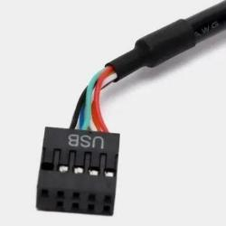

# Arduino argb PC

Возмозны ситуации когда у вас на ПК достаточно хорошая материнская плата,
но она не умеет управлять подсветкой ARGB. Этот проект пытается решить эту проблему.

Проект состоит из двух частей *ПРОШИВКА* и [GUI](https://github.com/lazenyuk-dmitry/ARGB4All_GUI) для управления подсветкой и настройки.

Изначально идея в том чтобы подключить микро контроллер Arduino к USB на материнской плате внутри корпуса ПК.
Но можно использовать и по другому, все ограничено только вашей фантазией.

- Необходимые детали
- Немного о подключении к материнской плате
- Схема подключения

## Необходимые детали

Иметь все необходимое не обязательно, можно и просто подключить провода так как вы хотите. Но лучше и удобнее найти все нужные коннекторы в интернет магазинах.

Существует два типа коннекторов ЖЕНСКИЙ(FEMALE) - как правило не имеет штырей для соединения, и МУЖСКОЙ(MALE) - имеет штыри для соединения.

- *Arduino Pro Micro* или *Arduino Leaonardo*. *Arduino Pro Micro* предпочтительнее в виду своих компактных размеров. Так же можно адаптировать прошивку для других МК на *ATmega32U4*.

- ARGB коннектор на 3 пина для подсветки 5V. Можно найти на маркетплейсах как ARGB разветвитель.
  Использовать можно как мужской так и женский разьем так как на вентеляторах часто пресутсткует оба типа подключения.
  Но лучше взять мужской, это ближе к тому как реализованно на материнских платах.
  
  
  

- MOLEX коннектор. Обычно с блока питания идет женский разьем, поэтому нам нужен мужской. *Лучше проверить какой коннектор у вас*.
  Это соединение нужно для того чтобы можно было проверить включен сейчас ПК или нет. Так же можно найти на маркетплейсах.
  

- Кабель USB A/Micro USB, можно использовать кабель от ардуино.

- Коннектор USB 2.0 для подключения к материнской плате. Нужен только женский разьем без штырей.
  Не обязательно использовать такое соединение, есть и другие варианты, читайте здесь *Немного о подключении к материнской плате*.
  Можно найти на маркет плейсах как *Переходник для материнской платы USB 2.0*.
  

- Резистор номиналом 10 кОм

- Ну и самоустройство с ARGB подсветкой которое будет подключаться.