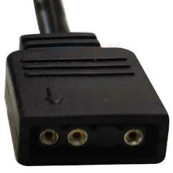
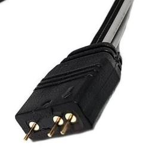
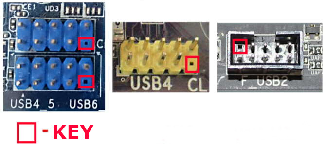
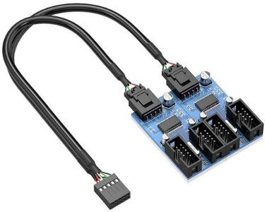

# Arduino argb PC

Возмозны ситуации когда у вас на ПК достаточно хорошая материнская плата,
но она не умеет управлять подсветкой ARGB. Этот проект пытается решить эту проблему.

Проект состоит из двух частей *ПРОШИВКА* и [GUI](https://github.com/lazenyuk-dmitry/ARGB4All_GUI) для управления подсветкой и настройки.

Изначально идея в том чтобы подключить микро контроллер Arduino к USB на материнской плате внутри корпуса ПК.
Но можно использовать и по другому, все ограничено только вашей фантазией.

- [Прошивка](#прошивка)
- [Необходимые детали](#необходимые-детали)
- [Немного о подключении к материнской плате](#немного-о-подключении-к-материнской-плате)
- [Схема подключения](#схема-подключения)
- [Делитель напряжения](#делитель-напряжения)
- [Настройка config.h](#настройка-configh)
- [Протокол коммуникации](#протокол-коммуникации)
- [Разработка](#разработка)

## Прошивка

Подключаем Arduino по USB к вашему ПК.

### Для Windows:

**Определяем какой порт присвоен вашей плате в системе**

Это можно посмотреть в *диспетчере устройств:*

1. Откройте Диспетчер устройств.
2. Нажмите «Вид» в строке меню и выберите «Показать скрытые устройства».
3. Найдите в списке порты (COM и LPT).
4. Проверьте наличие COM-портов, развернув их.

Или с помощью *командной строки*:

1. Откройте **Командную строку** или **Терминал (PowerShell)**.
2. Выполните слудующую команду `mode`.

**Прошивка с помощью AVRDUDESS**

1. Cкачайте последний [релиз (ARGB4All-X.X.X.zip)](https://github.com/lazenyuk-dmitry/ARGB4All/releases/tag/0.9.0).
1. Распакуйте архив.
1. Перейдите в директорию, куда вы распакавали архив.
1. Запустите файл `avrdudess.exe`.
1. Выберите пресет `Arduino Pro Micro (ATmega32U4)` или `Arduino Leonardo (ATmega32U4)`.
   *Если не прошивается попробуйте разный baud rate 57600 или 115200*.
1. Выьерите нужный COM порт. Как его узнать описанно выше.
1. Нажмите кнопку `Program!`
1. Дождитесь окончания процесса.

<!-- **Прошивка с помошью *Командной строки* или *Терминала (PowerShell)*:**

1. Скачать прошивку *firmware.hex*.
2. Скачать [avrdude-vX.X-windows-xXX.zip](https://github.com/avrdudes/avrdude/releases/latest) для вашей системы.
3. Распаковатьархив.
4. Скопировать файл *firmware.hex* в папку на один уровень с *avrdude.exe*.
5. Открыть командную строку или терминал в папке с *avrdude.exe*.
6. Вставить и выполнить следующую команду `avrdude -p atmega32u4 -c avr109 -P <PORT> -b 57600 -U flash:w:firmware.hex:i`.
   Меняем `PORT` на тот который мы узнали ранее.

   Например `avrdude -p atmega32u4 -c avr109 -P COM3 -b 57600 -U flash:w:firmware.hex:i`. -->

*Инструкция для **Linux** скоро будет...*

## Необходимые детали

Иметь все необходимое не обязательно, можно и просто подключить провода так как вы хотите. Но лучше и удобнее найти все нужные коннекторы в интернет магазинах.

Существует два типа коннекторов ЖЕНСКИЙ(FEMALE) - как правило не имеет штырей для соединения, и МУЖСКОЙ(MALE) - имеет штыри для соединения.

- *Arduino Pro Micro* или *Arduino Leaonardo*. *Arduino Pro Micro* предпочтительнее в виду своих компактных размеров. Так же можно адаптировать прошивку для других МК на *ATmega32U4*.

- ARGB коннектор на 3 пина для подсветки 5V. Можно найти на маркетплейсах как ARGB разветвитель.
  Использовать можно как мужской так и женский разьем так как на вентеляторах часто пресутсткует оба типа подключения.
  Но лучше взять мужской, это ближе к тому как реализованно на материнских платах.

  
  
  

- MOLEX коннектор. Обычно с блока питания идет женский разьем, поэтому нам нужен мужской. *Лучше проверить какой коннектор у вас*.
  Это соединение нужно для того чтобы можно было проверить включен сейчас ПК или нет. Так же можно найти на маркетплейсах.

  

- Кабель USB A/Micro USB, можно использовать кабель от ардуино.

- Коннектор USB 2.0 для подключения к материнской плате. Нужен только женский разьем без штырей.
  Не обязательно использовать такое соединение, есть и другие варианты, читайте здесь *Немного о подключении к материнской плате*.
  Можно найти на маркет плейсах как *Переходник для материнской платы USB 2.0*.

  

- Резистор номиналом 10 кОм

- Ну и самоустройство с ARGB подсветкой которое будет подключаться.

## Немного о подключении к материнской плате

Подключать микро контроллер ручше внитри корпуса ПК, к USB 2.0 разьему на материнской плате. Но ничто не мешает подключить просто в USB порт ПК.

Вот так обычно выглядит разьем на материнской плате (обычно внизу, на краю платы):

А вот подключение к USB материской платы:

Можно использовать вот такой коннектор:

А можно купить вот такие модули расширения и тогда не придется ничего паять:

А можно и разветвители найти если вам мало портов USB:

*Все то же самое можно найти и подключить в USB 3.0 на материнской плате. Но более выгодно занять один медленный USB 2.0 порт.*

## Схема подключения

*Обратите внимание что изначально без подключения сигнала на пине **2** светодиоды будут быстро моргать!*
*Так же если нету положителььного сигнала на пине **2** светодиоды не будут светиться вообще!*

Сигнальный провод (Power signal HIGTH/LOW) подключается к MOLEX идущему от блока питания.
Это нужно для определения включен ли сейчас ПК и отключения подсветки если ПК выключен.
Определение включеного состояния идет по LOW сигналу на пине *2*, тоесть во включеном состоянии на *красном* проводе MOLEX когда ПК включен должно быть напряжение +5V.
Если напряжение отсутствует, тогда подсветка будет отключена.

*Будьте внимательны на MOLEX подается +5V (красный провод) и +12V (желтый провод). Arduino работает только с напряжением 5V, и привышение этого напряжения может убить микроконтроллер*.

Распиновка MOLEX разьема:

## Делитель напряжения

Лучше и безопаснее отслеживать питание на линии 5V.
Но возможно что некоторые блоки питания не отключают линию +5V и тогда нужно будет отслеживать линию 12V, для этого нужно собрать или купить **делитель напряжения**

Дклитель напряжения 12V -> 4.8V на резисторах 100 Ом и 68 Ом.

*Можно использовать резисторы другого номинала если расчитать резисторы в каком нибудь онлайн калькуляторе. Например 100 кOм и 68 кОм или 10 Ом и 6.8 Ом*.

Или можно преобрести уже готовые преобразователи и делители напряжения.

## Настройка прошивки [config.h](/src/config.h)

*Чтобы изменить настройки нужно пересобрать проект!*

### Основные настройки:

`#define NUM_LEDS 60` - количество светодиодов в ленте. в нашем случае в подсветке вентелятора, ОЗУ и тд.

`#define POWER_PIN 2` - пин используется для определения состояния главного устройства (квлючено/отключено).

`#define DATA_PIN 3` - пин для управления светодиодами. Предпочтительно пины с PWM (D3, D5, D6, D9, D10, D16).

### Преднастройки по умолчанию:

`#define DEFAULT_COLOR CRGB::Blue` - цвет светодиодов.

`#define DEFAULT_BRIGTHNESS 255` - яркость светодиодов.

## Протокол коммуникации

Общение с микроконтроллером происходит с помощью строк по COM порту.
Парсинг по дыум символам `:` - разделитель [key]:[value] и `;` - конец команды.
Ниже список команд.

`COLOR:0,0,255;` - установить цвет. В данном случае голубой.

`BRIGTHNESS:100;` - установить значение яркости. В данном примере 100%.

`SAVE;` - сохранить настройки в EEPROM.

`RESET;` - сбросить до настроек по умолчанию.

Так же при установки соеденения с устроством, с микроконтроллера отправляются значения которые в данный момент установлены.

`COLOR:0,0,255;`
`BRIGTHNESS:100;`

## Разработка

1. Скачайте и установите редактор кода [Visual Studio Code](https://code.visualstudio.com/Download)
1. Клонируйте себе проект или скачайте как zip-файл.
1. Откройте проект в *Visual Studio Code*
1. Установите расширени для *Visual Studio Code* [PlatformIO IDE](https://marketplace.visualstudio.com/items?itemName=platformio.platformio-ide)
1. Возможно вам так же потребуется установить расширения для *С++* для комфортной работы.
1. После установки расширения *PlatformIO IDE* в нижнем статус баре появятся
   [кнопки для сборки и загрузки](https://docs.platformio.org/en/stable/integration/ide/vscode.html#platformio-toolbar) прошивки.
